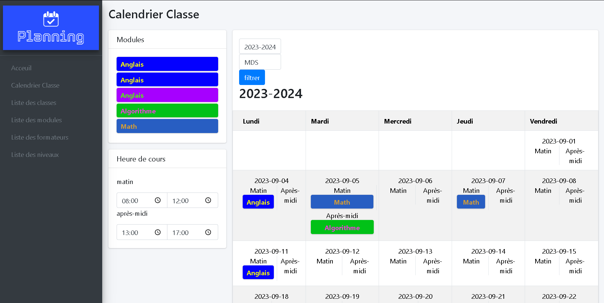

# Prérequis

- php
- Une BDD locale

# Configuration de la BDD

modifier dans le fichier les variables pour la connection à la BDD
~~~
ConnectBDD.php
~~~

~~~bash
$HOST = '';
$DB_NAME = '';
$DB_USER = '';
$DB_PASSWORD = '';
~~~

importer le fichier sql dans votre BDD
~~~
planning.sql
~~~

# lancer le projet,

~~~bash
php -S localhost:8000
~~~

en allant sur le lien vous devrier voir ceci

